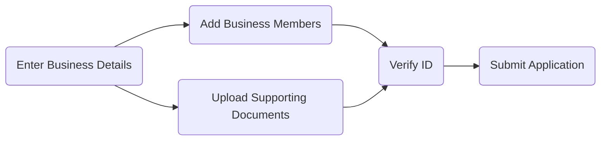

Paxos collects identifying information to ensure your [Organization](/guides/dashboard/organization#organization) complies with all regulations and requirements for the jurisdictions your business operates in. This involves entering business details, uploading organizational documents, and verifying IDs. 

The process takes about 30 minutes if you have everything ready, and Paxos may request additional information during review. 

<Note>
Depending on your business structure and operating jurisdiction, the review process can take anywhere from a day to weeks.
</Note>

## 1. Gather Documents

The list below can be used as a general guide for most institutions. Paxos may reach out to you for additional documentation as needed.

<AccordionGroup>

<Accordion title="Valid ID" id="valid-id">

Provide a **scanned color** document (i.e., valid passport, driver's license, or national ID) for all Beneficial Owners, Authorized Users, and Persons with Management Control.

This information is required for all platform users meeting the criteria, even if you have provided this previously.

</Accordion>

<Accordion title="Proof of Residential Address" id="proof-residential-address">

Provide a scanned PDF not older than 6 months (e.g., utility bill, cell phone bill, or bank statement) for all Beneficial Owners, Authorized Users, and Persons with Management Control.

This information is required for all platform users meeting the criteria, even if you have provided this previously.

</Accordion>

<Accordion title="Proof of Funds" id="proof-funds">

Bank statement or other equivalent document clearly showing the ownership under the Institution's name and dated within the last 6 months. Provide Proof of Funds substantiating requested trading volume.

</Accordion>

<Accordion title="Organizational Documents" id="organizational-documents">

Provide ONE of the following documents:

- Certificate of Incorporation
- Articles of Incorporation
- Certificate of Formation
- Articles of Organization
- National/State Government Registry filings, or equivalent

</Accordion>

<Accordion title="Evidence of Tax Identification Number / Registration Number" id="tax-identification">

Ensure the number is issued by the Internal Revenue Service (for US entities) or relevant governing body (for international entities).

</Accordion>

<Accordion title="Second Organizational Document" id="second-organizational-document">

Provide ONE of the following documents that was not provided as the first organizational document: 

- Certificate of Incorporation
- Articles of Incorporation
- Certificate of Formation
- Articles of Organization
- National/State Government Registry filings, or equivalent

</Accordion>

<Accordion title="Certificate of Good Standing or Equivalent" id="certificate-good-standing">

All Institutions that have been established for longer than 1 year must provide this document. This must be a document issued by a government registry and must be dated within the past year.

</Accordion>

</AccordionGroup>

## 2. Enter Business Details

Provide basic business (Institution) details to help determine onboarding requirements and ensure your use of the Paxos platform complies to the proper regulations and requirements for the jurisdiction.

You will need to provide the following:

- Institution type, incorporation ID type and incorporation ID.
- The legal incorporation address.

## 3. Provide Funding Details

Let Paxos know what industry sector your business operates in, the USD volume you expect to move to the Paxos platform, as well as the source of funds.

## 4. Suitability Assessment

Depending on the business jurisdiction, provide additional details regarding your business to ensure compliance with regional requirements when using the Paxos platform.

## 5. Business Members

Add personal identifying information for individuals that have a leadership role in the business.
Minimally, you will need to add a beneficial owner and a person with management control.
Depending on your business structure, you may need to add multiple persons.
An individual can perform more than one role.

## 6. Review and Verify

Review and accept all applicable terms and conditions, pricing and fee information before reviewing and accepting the entity onboarding information you provided.

## 7. Upload Documents

Before you can complete onboarding, provide Paxos with supporting documents for your organization.
You an upload the documents in the web application.
The list below can be used as a general guide for most institutions.
Paxos may reach out to you for additional documentation as needed.

## 8. Verify ID 

When the supporting documents are accepted, the final step is to provide individual identify information, which usually consists of providing a government issued ID such as passport, national ID card or driver license and taking a real-time "selfie" photo of you holding your ID.
To avoid common errors with the ID verification process:

- Ensure your webcam is enabled in the browser.
- Before uploading the ID, ensure all four corners of your ID document are visible, the text is clear and legible, and that the ID is not expired.
- Do not use a professional headshot for the real-time "selfie" photo. Take your "selfie" photo while holding your ID document at or near the time of onboarding.
