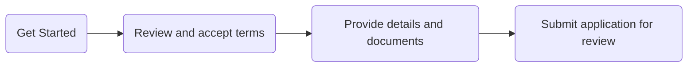

```mermaid
graph LR

    A(Get Started) --> B(Review and accept terms)
    B --> C(Provide details and documents)
    C --> D(Submit application for review)
```

<Tip>
  Go [here](https://dashboard.sandbox.paxos.com) to try Paxos Dashboard features in a sandbox environment.

  After signing up, select **Skip Onboarding** to get started.
</Tip>

Paxos collects identifying information to ensure your [Entity](/guides/dashboard/organization#organization) complies with all regulations and requirements for the jurisdictions your business operates in. This involves entering business details, uploading organizational documents, and verifying IDs.

The process takes about ~15 minutes if you have everything ready, and Paxos may request additional information during review.

<Note>
  Depending on your business structure and operating jurisdiction, the review process can take anywhere from a day to weeks.
</Note>

## 1. Gather Supporting Documents

The list below can be used as a general guide for most institutions. Paxos may reach out to you for additional documentation as needed.

<AccordionGroup>
  <Accordion title="Valid ID">
    Provide a **scanned color** document (i.e., valid passport, driver's license, or national ID) for all Beneficial Owners, Authorized Users, and Persons with Management Control.

    This information is required for all platform users meeting the criteria, even if you have provided this previously.
  </Accordion>

  <Accordion title="Proof of Residential Address">
    Provide a scanned PDF not older than 6 months (e.g., utility bill, cell phone bill, or bank statement) for all Beneficial Owners, Authorized Users, and Persons with Management Control.

    This information is required for all platform users meeting the criteria, even if you have provided this previously.
  </Accordion>

  <Accordion title="Proof of Funds">
    Bank statement or other equivalent document clearly showing the ownership under the Institution's name and dated within the last 6 months. Provide Proof of Funds substantiating requested trading volume.
  </Accordion>

  <Accordion title="Organizational Documents">
    Provide **two** of the following documents:

    - Certificate of Incorporation
    - Articles of Incorporation
    - Certificate of Formation
    - Articles of Organization
    - National/State Government Registry filings, or equivalent
  </Accordion>

  <Accordion title="Evidence of Tax Identification Number / Registration Number">
    Ensure the number is issued by the Internal Revenue Service (for US entities) or relevant governing body (for international entities).
  </Accordion>

  <Accordion title="Certificate of Good Standing or Equivalent">
    All Institutions that have been established for longer than 1 year must provide this document. This must be a document issued by a government registry and must be dated within the past year.
  </Accordion>
</AccordionGroup>

## 2. Get Started

Answer some basic questions about your business and how you're interested in working with Paxos, and accept our terms and conditions.  

## 3. Provide Business Details

Provide details about your business details to help determine onboarding requirements and ensure your use of the Paxos platform complies to the proper regulations and requirements for the jurisdiction.

You will need to provide the following:

- Institution type, incorporation ID type and incorporation ID.
- The legal incorporation and business address. 

### Funding Details

Let Paxos know what industry sector your business operates in, the USD volume you expect to move with the Paxos platform, as well as the source of funds.

### Business Members

Add personal identifying information for individuals that have ownership or leadership roles in the business. Minimally, you will need to add an account opener, beneficial owner and a person with management control. Depending on your business structure, you may need to add multiple persons. An individual can hold more than one role.

## 4. Review and Accept Pricing

Review and accept pricing and fee information. If you have a separate pricing agreement with Paxos, that will take precedence. 

## 5. Upload Documents

Before you can complete onboarding, provide Paxos with [supporting documents](/guides/dashboard/onboard#1-gather-supporting-documents) for your organization. You an upload the documents in the web application. Paxos may reach out to you for additional documentation as needed.