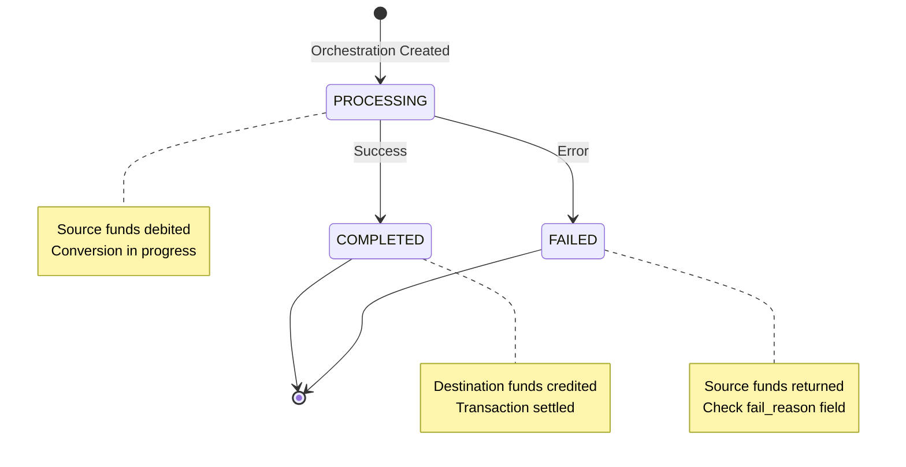

# Using Orchestration API

Converting between assets has now become simpler and more powerful with the introduction of the [Orchestration API](/api-reference/endpoints/orchestration/create-orchestration), still no fees and now allowing conversion from asset to asset as well as USD.
You can fetch all your conversion using [List Orchestration](/api-reference/endpoints/orchestration/list-orchestrations) and [lookup a single orchestration](/api-reference/endpoints/orchestration/get-orchestration). 

You can also [Create Orchestration Rules](/api-reference/endpoints/orchestration-rules/create-orchestration-rule) that automatically trigger orchestrations when matching deposits are received.

Webhooks allow you to track your orchestration status by subscribing to the [orchestration status change webhook](/api-reference/events/orchestration-status-change-object).

> If you've already authenticated and have USD and USDG balances in a Profile, skip ahead to the [request a conversion](#request-conversion) step.

## ➊ Authenticate

Include the following scopes when [authenticating](/guides/developer/authenticate):
```shell
conversion:read_conversion_stablecoin conversion:write_conversion_stablecoin funding:read_profile
```

> If you don't see all the scopes when [creating or editing API credentials](/guides/developer/credentials), contact [Support](https://support.paxos.com).

## ➋ Deposit USD and USDG

Use [Create Sandbox Deposit](/api-reference/endpoints/sandbox-deposits/create-sandbox-deposit) to add USD to the Profile (`profile_id`) you want the conversion to be associated with. See the [First API Request](/guides/developer/request) guide for help retrieving Profile IDs.
This guide also includes examples for the USDG → USD conversion, so if you are following along make sure you add some USDG to the Profile.
You can also use the [Fiat Transfers funding flow](/guides/developer/fiat-transfers/quickstart#funding) if you've already set up a Fiat Account.
### USD

```shell highlight={2}
curl --request POST \
--location 'https://api.sandbox.paxos.com/v2/sandbox/profiles/0d3172c5-8840-4bae-bdd4-30688f0268fc/deposit' \
--header 'Authorization: Bearer {access_token}' \
--data '{
  "asset": "USD",
  "amount": "1000"
}'
```
### USDG

```shell
curl --location 'https://api.sandbox.paxos.com/v2/sandbox/profiles/0d3172c5-8840-4bae-bdd4-30688f0268fc/deposit' \
--header 'Content-Type: application/json' \
--header 'Accept: application/json' \
--header 'Authorization: Bearer {access_token}' \
--data '{
    "asset": "USDG",
    "amount": "100",
    "crypto_network": "ETHEREUM"
}'
```

## ➌ Request an Orchestration

Request an orchestration using [Create Orchestration](/api-reference/endpoints/orchestration/create-orchestration).

Include the following body parameters in your request to convert the `source_asset` into the `destination_asset`.
For [Third-party integrations](/guides/crypto-brokerage/ledger-type#fiat-and-crypto-subledger), you must also specify `identity_id` and `account_id`.

### USDG → USD

```shell
curl --location 'https://api.sandbox.paxos.com/v2/orchestration/orchestrations' \
--header 'Content-Type: application/json' \
--header 'Authorization: Bearer {access_token}' \
--data '{
    "ref_id": "orch_usdg_usd_a284608c-4cf0-4605-ae0a-5c1f7ff109d3",
    "profile_id": "0d3172c5-8840-4bae-bdd4-30688f0268fc",
    "source_asset": "USDG",
    "source_amount": "100",
    "destination_asset": "USD",
    "source": {
        "profile": {
            "profile_id": "0d3172c5-8840-4bae-bdd4-30688f0268fc"
        }
    },
    "destination": {
        "profile": {
            "profile_id": "0d3172c5-8840-4bae-bdd4-30688f0268fc"
        }
    }
}'
```

The acknowledgement response includes the `id`, which can be used to lookup the orchestration.
The initial status will be `PROCESSING` as the orchestration executes.
The `source_asset` is immediately debited from the associated `profile_id` balance.
The `destination_asset` will be credited when the orchestration status transitions to `COMPLETED`.

```json
{
    "id": "ea284608c-4cf0-4605-ae0a-5c1f7ff109d3",
    "profile_id": "0d3172c5-8840-4bae-bdd4-30688f0268fc",
    "source_asset": "USDG",
    "source_amount": "100",
    "destination_asset": "USD",
    "destination_amount": "100",
    "status": "PROCESSING",
    "ref_id": "orch_usdg_usd_a284608c-4cf0-4605-ae0a-5c1f7ff109d3",
    "created_at": "2024-09-25T15:07:50.123456Z",
    "source": {
        "profile": {
            "profile_id": "0d3172c5-8840-4bae-bdd4-30688f0268fc"
        }
    },
    "destination": {
        "profile": {
            "profile_id": "0d3172c5-8840-4bae-bdd4-30688f0268fc"
        }
    },
    ...
}
```

### USDG → PYUSD

```shell
curl --location 'https://api.sandbox.paxos.com/v2/orchestration/orchestrations' \
--header 'Content-Type: application/json' \
--header 'Authorization: Bearer {access_token}' \
--data '{
    "ref_id": "orch_usdg_pyusd_8f91a9c5-0a6e-46dc-ad68-17bc8fb4eafb",
    "profile_id": "0d3172c5-8840-4bae-bdd4-30688f0268fc",
    "source_asset": "USDG",
    "source_amount": "100",
    "destination_asset": "PYUSD",
    "source": {
        "profile": {
            "profile_id": "0d3172c5-8840-4bae-bdd4-30688f0268fc"
        }
    },
    "destination": {
        "profile": {
            "profile_id": "0d3172c5-8840-4bae-bdd4-30688f0268fc"
        }
    }
}'
```

The acknowledgement response includes the `id`, which can be used to lookup the orchestration.
The initial status will be `PROCESSING` as the orchestration executes.
The `source_asset` is immediately debited from the associated `profile_id` balance.
The `destination_asset` will be credited when the orchestration status transitions to `COMPLETED`.

```json
{
    "id": "f190b163-208f-4d73-8deb-4fb8b24add00",
    "profile_id": "0d3172c5-8840-4bae-bdd4-30688f0268fc",
    "source_asset": "USDG",
    "source_amount": "100",
    "destination_asset": "PYUSD",
    "destination_amount": "100",
    "status": "PROCESSING",
    "ref_id": "orch_usdg_pyusd_8f91a9c5-0a6e-46dc-ad68-17bc8fb4eafb",
    "created_at": "2024-09-25T15:07:15.654321Z",
    "source": {
        "profile": {
            "profile_id": "0d3172c5-8840-4bae-bdd4-30688f0268fc"
        }
    },
    "destination": {
        "profile": {
            "profile_id": "0d3172c5-8840-4bae-bdd4-30688f0268fc"  
        }
    },
    ...
}
```

## ➍ Create an Orchestration Rule 

To create a persistent rule that is triggered by a deposit you can use [Create Orchestration Rules](/api-reference/endpoints/orchestration-rules/create-orchestration-rule).

For example, to automatically convert USD deposits to USDG:

```shell
curl --location 'https://api.sandbox.paxos.com/v2/orchestration/rules' \
--header 'Content-Type: application/json' \
--header 'Authorization: Bearer {access_token}' \
--data '{
    "ref_id": "rule_usd_to_usdg_auto_convert",
    "nickname": "Auto Convert USD to USDG",
    "profile_id": "0d3172c5-8840-4bae-bdd4-30688f0268fc",
    "source_asset": "USD",
    "destination_asset": "USDG",
    "source": {
        "fiat": {
            "network": "WIRE",
            "account_type": "CHECKING"
        }
    },
    "destination": {
        "profile": {
            "profile_id": "0d3172c5-8840-4bae-bdd4-30688f0268fc"
        }
    }
}'
```

The response includes deposit instructions and the rule configuration:

```json
{
    "rule": {
        "id": "rule_7f8a9b1c-2d3e-4f5g-6h7i-8j9k0l1m2n3o",
        "ref_id": "rule_usd_to_usdg_auto_convert",
        "nickname": "Auto Convert USD to USDG",
        "profile_id": "0d3172c5-8840-4bae-bdd4-30688f0268fc",
        "status": "ACTIVE",
        "source_asset": "USD",
        "destination_asset": "USDG",
        "source": {
            "fiat": {
                "deposit_instructions_id": "dep_inst_abc123",
                "network": "WIRE",
                "account_type": "CHECKING",
                "routing_details": {
                    "routing_number": "021000021",
                    "account_number": "1234567890",
                    "bank_name": "JP Morgan Chase",
                    "bank_address": "270 Park Avenue, New York, NY 10017"
                }
            }
        },
        "destination": {
            "profile": {
                "profile_id": "0d3172c5-8840-4bae-bdd4-30688f0268fc"
            }
        },
        "created_at": "2024-09-25T15:08:30.987654Z"
    }
}
```

When deposits are received to the provided deposit instructions, an orchestration will automatically be triggered to convert the funds to the destination asset. Each triggered orchestration will include an `orchestration_rule_id` field referencing this rule. 

## ➎ Monitor Orchestration Status

### Recommended: Using Webhooks

> **Best Practice**: Subscribe to orchestration webhooks for real-time status monitoring. This is the recommended approach as it provides immediate notifications without polling.

Subscribe to orchestration status webhooks:
- [`orchestration.processing`](/api-reference/webhooks/orchestration-processing) - When orchestration begins
- [`orchestration.completed`](/api-reference/webhooks/orchestration-completed) - When orchestration succeeds  
- [`orchestration.failed`](/api-reference/webhooks/orchestration-failed) - When orchestration fails

The webhook payload contains an event ID that you use to fetch the full [`orchestration_status_change`](/api-reference/events/orchestration-status-change-object) event details:

```json
{
    "type": "orchestration.completed",
    "event_id": "3fa85f64-5717-4562-b3fc-2c963f66afa6",
    "timestamp": "2024-09-25T15:07:56.076853Z"
}
```

Fetch the event details to get the orchestration information:

```json
{
    "id": "ea284608c-4cf0-4605-ae0a-5c1f7ff109d3",
    "orchestration_rule_id": "7f8a9b1c-2d3e-4f5a-6b7c-8d9e0f1a2b3c",  // Present if triggered by a rule
    "ref_id": "orch_usdg_usd_a284608c-4cf0-4605-ae0a-5c1f7ff109d3",
    "status": "COMPLETED"
}
```

> When orchestrations are triggered by a rule, the event object will include an `orchestration_rule_id` field linking back to the originating rule.

### Alternative: Polling with API

Use [List Orchestrations](/api-reference/endpoints/orchestration/list-orchestrations) to check orchestration status:

```shell
curl --location 'https://api.sandbox.paxos.com/v2/orchestration/orchestrations?profile_id=0d3172c5-8840-4bae-bdd4-30688f0268fc&order=DESC' \
--header 'Accept: application/json' \
--header 'Authorization: Bearer {access_token}'
```

The response includes all orchestrations for the profile with their current status:

```json
{
    "orchestrations": [
        {
            "id": "ea284608c-4cf0-4605-ae0a-5c1f7ff109d3",
            "profile_id": "0d3172c5-8840-4bae-bdd4-30688f0268fc",
            "source_asset": "USDG",
            "source_amount": "100",
            "destination_asset": "USD",
            "destination_amount": "100",
            "status": "COMPLETED",
            "ref_id": "orch_usdg_usd_a284608c-4cf0-4605-ae0a-5c1f7ff109d3",
            "created_at": "2024-09-25T15:07:50.123456Z",
            "completed_at": "2024-09-25T15:07:56.076853Z",
            ...
        },
        {
            "id": "f190b163-208f-4d73-8deb-4fb8b24add00",
            "profile_id": "0d3172c5-8840-4bae-bdd4-30688f0268fc",
            "orchestration_rule_id": "7f8a9b1c-2d3e-4f5a-6b7c-8d9e0f1a2b3c",
            "source_asset": "USD",
            "source_amount": "100",
            "destination_asset": "PYUSD", 
            "destination_amount": "100",
            "status": "COMPLETED",
            "ref_id": "auto_rule_generated_ref_123",
            "created_at": "2024-09-25T15:07:15.654321Z",
            "completed_at": "2024-09-25T15:07:21.548903Z",
            ...
        }
    ],
    "next_page_cursor": "..."
}
```

### Orchestration State Machine

Orchestrations progress through the following states:



- `PROCESSING`: The orchestration has been created and is being executed. Source assets are debited immediately.
- `COMPLETED`: The orchestration succeeded. Destination assets have been credited.
- `FAILED`: The orchestration failed. Source assets are returned. Check the `fail_reason` field for details.


# Using Legacy API

Next, use the [Stablecoin Conversion API](/api-reference/endpoints/stablecoin-conversion/create-stablecoin-conversion) to easily convert USD to any [supported asset](/guides/developer/convert#assets), and vice verse, without any fees.
Keep track of all your conversions with [List Stablecoin Conversions](/api-reference/endpoints/stablecoin-conversion/list-stablecoin-conversions) or [lookup a single conversion](/api-reference/endpoints/stablecoin-conversion/get-stablecoin-conversion).

> If you've already authenticated and have USD and USDG balances in a Profile, skip ahead to the [request a conversion](#request-conversion) step.

## ➊ Authenticate

Include the following scopes when [authenticating](/guides/developer/authenticate):
```shell
conversion:read_conversion_stablecoin conversion:write_conversion_stablecoin funding:read_profile
```

> If you don't see all the scopes when [creating or editing API credentials](/guides/developer/credentials), contact [Support](https://support.paxos.com).

## ➋ Deposit USD and USDG

Use [Create Sandbox Deposit](/api-reference/endpoints/sandbox-deposits/create-sandbox-deposit) to add USD to the Profile (`profile_id`) you want the conversion to be associated with. See the [First API Request](/guides/developer/request) guide for help retrieving Profile IDs.
This guide also includes examples for the USDG → USD conversion, so if you are following along make sure you add some USDG to the Profile.
You can also use the [Fiat Transfers funding flow](/guides/developer/fiat-transfers/quickstart#funding) if you've already set up a Fiat Account.
### USD

```shell highlight={2}
curl --request POST \
--location 'https://api.sandbox.paxos.com/v2/sandbox/profiles/0d3172c5-8840-4bae-bdd4-30688f0268fc/deposit' \
--header 'Authorization: Bearer {access_token}' \
--data '{
  "asset": "USD",
  "amount": "1000"
}'
```
### USDG

```shell
curl --location 'https://api.sandbox.paxos.com/v2/sandbox/profiles/0d3172c5-8840-4bae-bdd4-30688f0268fc/deposit' \
--header 'Content-Type: application/json' \
--header 'Accept: application/json' \
--header 'Authorization: Bearer {access_token}' \
--data '{
    "asset": "USDG",
    "amount": "100",
    "crypto_network": "ETHEREUM"
}'
```
## ➌ Request Conversion

Request a conversion using [Create Stablecoin Conversion](/api-reference/endpoints/stablecoin-conversion/create-stablecoin-conversion).
Include the following body parameters in your request to convert the `source_asset` of $100 USD into the `target_asset`.
For [Third-party integrations](/guides/crypto-brokerage/ledger-type#fiat-and-crypto-subledger), you must also specify `identity_id` and `account_id`.
### USDG → USD

```shell
curl --location 'https://api.sandbox.paxos.com/v2/conversion/stablecoins' \
--header 'Content-Type: application/json' \
--header 'Authorization: Bearer {access_token}' \
--data '{
    "ref_id": "sc_usdg_a284608c-4cf0-4605-ae0a-5c1f7ff109d3",
    "profile_id": "0d3172c5-8840-4bae-bdd4-30688f0268fc",
    "amount": "100",
    "source_asset": "USDG",
    "target_asset": "USD",
}'
```
The acknowledgement response includes the `id`, which can be used to lookup the transaction, and the status will always be `CREATED`.
The `source_asset` is immediately debited from the associated `profile_id` balance.
The `target_asset` will not be credited until the [conversion status](/guides/developer/convert#statuses) is \"status": "SETTLED"`.

```json
{
    "id": "ea284608c-4cf0-4605-ae0a-5c1f7ff109d3",
    "profile_id": "0d3172c5-8840-4bae-bdd4-30688f0268fc",
    "amount": "100",
    "source_asset": "USDG",
    "target_asset": "USD",
    "status": "CREATED",
    "ref_id": "sc_usdg_a284608c-4cf0-4605-ae0a-5c1f7ff109d3",
    ...
}
```
### USD → PYUSD

```shell
curl --location 'https://api.sandbox.paxos.com/v2/conversion/stablecoins' \
--header 'Content-Type: application/json' \
--header 'Authorization: Bearer {access_token}' \
--data '{
    "ref_id": "sc_pyusd_8f91a9c5-0a6e-46dc-ad68-17bc8fb4eafb",
    "profile_id": "0d3172c5-8840-4bae-bdd4-30688f0268fc",
    "amount": "100",
    "source_asset": "USD",
    "target_asset": "PYUSD",
}'
```

The acknowledgement response includes the `id`, which can be used to lookup the transaction, and the status will always be `CREATED`.
The `source_asset` is immediately debited from the associated `profile_id` balance.
The `target_asset` will not be credited until the [conversion status](/guides/developer/convert#statuses) is \"status": "SETTLED"`.

```json
{
    "id": "f190b163-208f-4d73-8deb-4fb8b24add00",
    "profile_id": "0d3172c5-8840-4bae-bdd4-30688f0268fc",
    "amount": "100",
    "source_asset": "USD",
    "target_asset": "PYUSD",
    "status": "CREATED",
    "ref_id": "sc_pyusd_8f91a9c5-0a6e-46dc-ad68-17bc8fb4eafb",
    ...
}
```
## ➍ Confirm the Conversion

Use [List Stablecoin Conversions](/api-reference/endpoints/stablecoin-conversion/list-stablecoin-conversions) to check the conversion status.
The request requires the `profile_id` query parameter.

```shell
curl --location 'https://api.sandbox.paxos.com/v2/conversion/stablecoins?profile_id=0d3172c5-8840-4bae-bdd4-30688f0268fc&order=DESC' \
--header 'Accept: application/json' \
--header 'Authorization: Bearer {access_token}'
```

The returned array includes the `settled_at` parameter and the status is `SETTLED` for all conversions executed for the given Profile.

```json
{
    "items": [
        {
            "id": "08f67bca-fb30-4006-8ed2-d46750dd1293",
            "profile_id": "0d3172c5-8840-4bae-bdd4-30688f0268fc",
            "amount": "100",
            "source_asset": "USDG",
            "target_asset": "USD",
            "status": "SETTLED",
            ...
            "settled_at": "2024-09-25T15:07:56.076853Z"
        },
        {
            "id": "9f458a60-8b9b-4b3c-b5a4-ee57bc795086",
            "profile_id": "0d3172c5-8840-4bae-bdd4-30688f0268fc",
            "amount": "100",
            "source_asset": "USD",
            "target_asset": "PYUSD",
            "status": "SETTLED",
            ...
            "settled_at": "2024-09-25T15:07:21.548903Z"
        },
    ]
}
```

## Stablecoin Conversion Asset Precision

You can convert USD to any supported asset and vice versa.
However, you cannot convert one stablecoin to another.
All conversions use the lowest maximum precision among the asset pairs.

| Supported Asset | Maximum Decimal Precision | Example Conversion Precision |
| --- | --- | -- |
| USD | 0.01 (1e-2) | USD → USDG = 0.01 (1e-2) |
| [PYUSD](/guides/stablecoin/pyusd) | 0.000001 (1e-6) | PYUSD → USD = 0.01 (1e-2) |
| [USDG](/guides/stablecoin/usdg) | 0.00000001 (1e-8) | USDG → USD = 0.01 (1e-2) |
| [USDP](/guides/stablecoin/usdp) | 	0.00000001 (1e-8) | USDP → USD = 0.01 (1e-2) |

## Stablecoin Conversion Statuses

There are three conversion statuses:

- `CREATED`: The conversion has been submitted successfully but has not yet settled. 
- `SETTLED`: The conversion has been completed.
- `CANCELLED`: The conversion was stopped [using the cancel endpoint](/api-reference/endpoints/stablecoin-conversion/cancel-stablecoin-conversion) for the pending conversion.

When a conversion is in `CREATED` status, the `source_asset` (for example, fiat for acquiring stablecoin) will be debited from the `profile_id` balance.
The `target_asset` (for example, USDG for acquiring stablecoin) will not be credited until the order has `SETTLED`.

<Tip>

 Best Practice

- Build a pending conversion settlement workflow for edge cases where the conversion does not settle immediately. This is especially important for subledgered customers, where the user will be unable to sell or transfer the assets until the conversion has settled and the asset has been credited to their Profile.
- Log the transaction details from each conversion in a database.
- Cache Profile balances. Balances should be updated once there has been a change to the Profile balance (for example, after a conversion) and then perform a reconciliation to confirm the updated balance matches the client's internal calculation.
- Create a polling workflow to query the results in ascending order. Keep track of the `created_at` timestamp of the most recent conversion in the paged results.

</Tip>
