## Overview

Orchestrations enable seamless conversions between different stablecoins and currencies. These can be triggered through ad-hoc orchestrations from profiles or rule-based orchestrations from external deposits, allowing you to convert assets and route them to profiles or external addresses.

## Conversion Flow Options

```mermaid
graph LR
    %% Color scheme
    classDef profile fill:#e6f7ed,stroke:#16a34a,stroke-width:2px,color:#15803d
    classDef crypto fill:#f3e5f5,stroke:#9333ea,stroke-width:2px,color:#6b21a8
    classDef external fill:#e0e7ff,stroke:#3730a3,stroke-width:2px,color:#312e81
    classDef apiCall fill:#f3f4f6,stroke:#6b7280,stroke-width:2px,color:#374151
    classDef rule fill:#fef3c7,stroke:#f59e0b,stroke-width:2px,color:#92400e
    classDef paxosBox fill:transparent,stroke:#16a34a,stroke-width:2px,stroke-dasharray:5
    classDef externalBox fill:transparent,stroke:#3730a3,stroke-width:2px,stroke-dasharray:5
    
    %% Example 1: Ad-hoc Profile to Profile
    CreateOrch["🔧 API: Create<br/>Orchestration"]:::apiCall
    
    subgraph flow1["Example 1: Ad-hoc (Profile to Profile)"]
        ProfilePYUSD["👤 Profile<br/>PYUSD Balance"]:::profile
        DestProfileUSDG["👤 Profile<br/>USDG Balance"]:::profile
    end
    
    %% Example 2: Rule-based External to External
    CreateRule["🔧 API: Create<br/>Orchestration Rule"]:::apiCall
    ExtDeposit["⛓ External<br/>USDG Deposit"]:::external
    
    subgraph flow2["Example 2: Rule-based (External to External)"]
        USDGRule["📋 USDG Deposit<br/>Rule"]:::rule
        ExtUSDC["⛓ External Address<br/>USDC Tokens"]:::crypto
    end
    
    %% Flow 1 connections
    CreateOrch ==>|"Initiates"| ProfilePYUSD
    ProfilePYUSD -->|"Convert PYUSD → USDG"| DestProfileUSDG
    
    %% Flow 2 connections
    CreateRule ==>|"Creates"| USDGRule
    ExtDeposit -.->|"Activates"| USDGRule
    USDGRule -->|"Convert USDG → USDC<br/>& withdraw"| ExtUSDC
```



## Creating Conversions

### Example 1: PYUSD → USDG (Ad-hoc, Profile to Profile)

Use the [Create Orchestration](/api-reference/endpoints/orchestration/create-orchestration) endpoint to convert PYUSD to USDG within your Paxos profile:

<Expandable title="Request">

```bash
curl -X POST 'https://api.paxos.com/v2/orchestration/orchestrations' \
  -H 'Authorization: Bearer {access_token}' \
  -H 'Content-Type: application/json' \
  -d '{
    "ref_id": "convert_pyusd_usdg_profile",
    "profile_id": "{profile_id}",
    "source_asset": "PYUSD",
    "source_amount": "100",
    "destination_asset": "USDG",
    "source": {
      "profile": {
        "profile_id": "{profile_id}"
      }
    },
    "destination": {
      "profile": {
        "profile_id": "{profile_id}"
      }
    }
  }'
```

</Expandable>

<Expandable title="Response">

```json
{
  "orchestration": {
    "id": "orch_123abc",
    "ref_id": "convert_pyusd_usdg_profile",
    "profile_id": "{profile_id}",
    "source_asset": "PYUSD",
    "source_amount": "100",
    "destination_asset": "USDG",
    "destination_amount": "100",
    "source": {
      "profile": {
        "profile_id": "{profile_id}"
      }
    },
    "destination": {
      "profile": {
        "profile_id": "{profile_id}"
      }
    },
    "status": "PROCESSING",
    "created_at": "2024-01-15T10:00:00Z"
  }
}
```

</Expandable>

### Example 2: USDG → USDC (Rule-based, External to External)

Use the [Create Orchestration Rule](/api-reference/endpoints/orchestration-rules/create-orchestration-rule) endpoint to automatically convert external USDG deposits to USDC and send to an external address. You can optionally [pre-register the destination address](./orchestrations#prerequisites-for-external-crypto-destinations):

<Expandable title="Request">

```bash
curl -X POST 'https://api.paxos.com/v2/orchestration/rules' \
  -H 'Authorization: Bearer {access_token}' \
  -H 'Content-Type: application/json' \
  -d '{
    "ref_id": "convert_usdg_usdc_rule",
    "nickname": "Auto Convert USDG to USDC",
    "profile_id": "{profile_id}",
    "source_asset": "USDG",
    "destination_asset": "USDC",
    "source": {
      "crypto": {
        "network": "ETHEREUM"
      }
    },
    "destination": {
      "crypto": {
        "address": "0x742d35Cc6634C0532925a3b844Bc9e7595f0bEb",
        "network": "ETHEREUM"
      }
    }
  }'
```

</Expandable>

<Expandable title="Response">

```json
{
  "rule": {
    "id": "rule_456def",
    "ref_id": "convert_usdg_usdc_rule",
    "nickname": "Auto Convert USDG to USDC",
    "profile_id": "{profile_id}",
    "source_asset": "USDG",
    "destination_asset": "USDC",
    "source": {
      "crypto": {
        "address_id": "addr_789xyz",
        "address": "0x8B3D70c8F55e9C7E5b0bC2A9b0e7d1fF2c3d4E5F",
        "network": "ETHEREUM"
      }
    },
    "destination": {
      "crypto": {
        "address": "0x742d35Cc6634C0532925a3b844Bc9e7595f0bEb",
        "network": "ETHEREUM"
      }
    },
    "status": "ACTIVE",
    "created_at": "2024-01-15T10:00:00Z"
  }
}
```

</Expandable>

## How It Works

### Ad-hoc Conversions
1. **Call the API**: Create an orchestration specifying source and destination assets
2. **Validation**: Paxos validates the request and available balance
3. **Conversion**: Assets are converted
4. **Delivery**: Converted assets are deposited to the specified profile
5. **Monitor Status**: Track your orchestration progress using [webhooks or API polling](./orchestrations#monitoring-orchestration-status)

### Rule-based Conversions
1. **Create the Rule**: Set up an orchestration rule for automatic conversion
2. **Get Deposit Address**: Use the address returned in the rule's `source.crypto.address` field
3. **Receive Deposit**: External USDG arrives at your Paxos crypto address
4. **Automatic Trigger**: The rule detects the deposit and initiates conversion
5. **Conversion**: USDG is converted to USDC
6. **Delivery**: USDC is sent to the specified external address
7. **Monitor Status**: Track your orchestration progress using [webhooks or API polling](./orchestrations#monitoring-orchestration-status)

## Next Steps

- Learn about [minting stablecoins](./mint) from USD deposits
- Explore [redeeming stablecoins](./redeem) back to USD

