## Overview

Orchestrations enable you to automatically convert USD into stablecoins. This powerful feature enables seamless fiat-to-crypto conversions through rule-based orchestrations that trigger upon receiving bank transfers.
You can also mint straight from profile USD funds by issuing an ad-hoc conversion.

## Mint Flow Options

The following diagram shows two example mint flows:

```mermaid
graph LR
    %% Color scheme
    classDef bank fill:#e0e7ff,stroke:#3730a3,stroke-width:2px,color:#312e81
    classDef rule fill:#fef3c7,stroke:#f59e0b,stroke-width:2px,color:#92400e
    classDef profile fill:#e6f7ed,stroke:#16a34a,stroke-width:2px,color:#15803d
    classDef crypto fill:#f3e5f5,stroke:#9333ea,stroke-width:2px,color:#6b21a8
    classDef paxosBox fill:transparent,stroke:#16a34a,stroke-width:2px,stroke-dasharray:5
    classDef externalBox fill:transparent,stroke:#3730a3,stroke-width:2px,stroke-dasharray:5
    
    %% Bank deposit triggers
    BankDeposit["🏦 USD Bank<br/>Deposit"]:::bank
    
    %% Orchestration rules
    subgraph rules["ORCHESTRATION RULES"]
        Rule1["📋 Rule 1:<br/>USD → USDC<br/>to Profile"]:::rule
        Rule2["📋 Rule 2:<br/>USD → USDG<br/>to External"]:::rule
    end
    
    %% Destinations
    subgraph paxosDest["Paxos Profile"]
        ProfileUSDC["👤 Profile<br/>USDC Balance"]:::profile
    end
    
    subgraph extDest["External Wallet"]
        ExtUSDG["⛓ External Address<br/>USDG Tokens"]:::crypto
    end
    
    %% Flow connections
    BankDeposit -->|"Matches<br/>Rule 1"| Rule1
    BankDeposit -->|"Matches<br/>Rule 2"| Rule2
    
    Rule1 ==>|"Converts &<br/>Deposits"| ProfileUSDC
    Rule2 ==>|"Converts &<br/>Withdraws"| ExtUSDG
    
    %% Style the subgraphs
    class paxosDest paxosBox
    class extDest externalBox
```



## Creating Mint Orchestration Rules

Use the [Create Orchestration Rule](/api-reference/endpoints/orchestration-rules/create-orchestration-rule) endpoint to set up the rule-based minting:

### Example 1: USD → USDC (Bank to Profile)

Create a rule that automatically converts USD deposits to USDC and stores in your profile:

<Expandable title="Request">

```bash
curl -X POST 'https://api.paxos.com/v2/orchestration/rules' \
  -H 'Authorization: Bearer {access_token}' \
  -H 'Content-Type: application/json' \
  -d '{
    "ref_id": "mint_usd_to_usdc_profile",
    "nickname": "Auto Mint USDC to Profile",
    "profile_id": "{profile_id}",
    "source_asset": "USD",
    "destination_asset": "USDC",
    "source": {
      "fiat": {
        "network": "WIRE",
        "account_type": "SWIFT"
      }
    },
    "destination": {
      "profile": {
        "profile_id": "{profile_id}"
      }
    }
  }'
```

</Expandable>

<Expandable title="Response">

```json
{
  "rule": {
    "id": "rule_abc123",
    "ref_id": "mint_usd_to_usdc_profile",
    "nickname": "Auto Mint USDC to Profile",
    "profile_id": "{profile_id}",
    "source_asset": "USD",
    "destination_asset": "USDC",
    "source": {
      "fiat": {
        "deposit_instructions_id": "fiat_instr_123",
        "network": "WIRE",
        "account_type": "SWIFT",
        "memo_id": "PAXOS123456"
      }
    },
    "destination": {
      "profile": {
        "profile_id": "{profile_id}"
      }
    },
    "status": "ACTIVE",
    "created_at": "2024-01-15T10:00:00Z"
  }
}
```

</Expandable>

### Example 2: USD → USDG (Bank to External Crypto Address)

Create a rule that automatically converts USD deposits to USDG and sends to an external address. First [register the destination address](./orchestrations#required-setup-for-external-crypto-destinations) to get a `crypto_address_id`:

<Expandable title="Request">

```bash
curl -X POST 'https://api.paxos.com/v2/orchestration/rules' \
  -H 'Authorization: Bearer {access_token}' \
  -H 'Content-Type: application/json' \
  -d '{
    "ref_id": "mint_usd_to_usdg_external",
    "nickname": "Auto Mint USDG to External",
    "profile_id": "{profile_id}",
    "source_asset": "USD",
    "destination_asset": "USDG",
    "source": {
      "fiat": {
        "network": "WIRE",
        "account_type": "SWIFT"
      }
    },
    "destination": {
      "crypto": {
        "crypto_address_id": "crypto_addr_789xyz"
      }
    }
  }'
```

</Expandable>

<Expandable title="Response">

```json
{
  "rule": {
    "id": "rule_xyz789",
    "ref_id": "mint_usd_to_usdg_external",
    "nickname": "Auto Mint USDG to External",
    "profile_id": "{profile_id}",
    "source_asset": "USD",
    "destination_asset": "USDG",
    "source": {
      "fiat": {
        "deposit_instructions_id": "fiat_instr_456",
        "network": "WIRE",
        "account_type": "SWIFT",
        "memo_id": "PAXOS789012"
      }
    },
    "destination": {
      "crypto": {
        "crypto_address_id": "crypto_addr_789xyz"
      }
    },
    "status": "ACTIVE",
    "created_at": "2024-01-15T10:00:00Z"
  }
}
```

</Expandable>

## How It Works

1. **Create the Rule**: Use the API to create an orchestration rule specifying source (bank deposit) and destination (profile or external address)
2. **Get Deposit Instructions**: Use the `deposit_instructions_id` and `memo_id` from the response to retrieve full banking details via [Get Fiat Deposit Instructions](/api-reference/endpoints/fiat-transfers/get-fiat-deposit-instructions)
3. **Send Wire Transfer**: Send USD to the Paxos bank account using the provided instructions and memo ID
   - For sandbox testing, see [how to simulate fiat deposits](/guides/developer/fiat-transfers/quickstart#➋-send-fiat-to-paxos)
4. **Automatic Trigger**: The rule detects the deposit and initiates the orchestration
5. **Conversion**: USD is converted to your specified stablecoin (USDC, USDG, etc.)
6. **Delivery**: Stablecoins are either:
   - Deposited to your Paxos profile (Flow 1)
   - Sent to the external crypto address (Flow 2)
7. **Monitor Status**: Track your orchestration progress using [webhooks or API polling](./orchestrations#monitoring-orchestration-status)

## Next Steps

- Learn about [redeeming stablecoins](./redeem) back to USD
- Explore [conversions](./convert) between different stablecoins
