## Understanding Orchestrations

Orchestrations allow customers to perform complex actions by executing multi-step
workflows to move between assets, networks, and rails. There are two types of Orchestrations
ad-hoc, and rule-based. Rule-based orchestrations are based off a rule which is triggered
upon deposit to a crypto address or a bank account. Ad-hoc orchestrations are one-off
orchestrations that can be triggered to move funds from a profile to a number of destinations.

As we'll show in the [mint](), [convert](), and [redeem]() pages these orchestrations can
be harnessed to perform a number of operations.

## Orchestration Flow Diagram

The following diagram illustrates all possible orchestration routes within the Paxos platform:

```mermaid
graph TB
    %% Styling for dark/light mode compatibility
    classDef external fill:#f9f9f9,stroke:#666,stroke-width:2px,color:#000
    classDef internal fill:#f0f4f8,stroke:#4a5568,stroke-width:2px,color:#000
    classDef managed fill:#faf5ef,stroke:#805ad5,stroke-width:2px,color:#000
    classDef groupBox fill:transparent,stroke:#888,stroke-width:2px,stroke-dasharray:5
    classDef ruleFlow stroke:#e53e3e,stroke-width:3px
    classDef adhocFlow stroke:#3182ce,stroke-width:3px
    
    subgraph "EXTERNAL SOURCES (Trigger Rule-based Orchestrations)"
        ExtFiat["🏦 Bank Deposit<br/>External Fiat"]:::external
        ExtCrypto["🔗 Blockchain Deposit<br/>External Crypto"]:::external
    end
    
    subgraph "PAXOS MANAGED (Deposit Instructions)"
        FiatInstr["📋 Fiat Deposit<br/>Instructions"]:::managed
        CryptoInstr["📋 Crypto Deposit<br/>Address"]:::managed
    end
    
    subgraph "INTERNAL PROFILES (Trigger Ad-hoc Orchestrations)"
        Profile1["👤 Profile A"]:::internal
        Profile2["👤 Profile B"]:::internal
        Profile3["👤 Profile C"]:::internal
    end
    
    subgraph "DESTINATIONS"
        subgraph "Internal Destinations"
            DestProfile1["👤 Profile A"]:::internal
            DestProfile2["👤 Profile B"]:::internal
            DestProfile3["👤 Profile C"]:::internal
        end
        
        subgraph "External Destinations"
            DestExtFiat["🏦 Bank Account<br/>External Fiat"]:::external
            DestExtCrypto["🔗 Blockchain Address<br/>External Crypto"]:::external
        end
    end
    
    %% Rule-based flows (red/dashed)
    ExtFiat -.->|"Rule-based<br/>Orchestration"| FiatInstr
    ExtCrypto -.->|"Rule-based<br/>Orchestration"| CryptoInstr
    FiatInstr -.->|"Auto-routes to<br/>profile if rule matches"| DestProfile1
    FiatInstr -.->|" "| DestProfile2
    CryptoInstr -.->|"Auto-routes to<br/>profile if rule matches"| DestProfile1
    CryptoInstr -.->|" "| DestProfile2
    
    %% Ad-hoc flows (blue/solid)
    Profile1 ==>|"Ad-hoc<br/>Orchestration"| DestProfile2
    Profile1 ==>|" "| DestProfile3
    Profile1 ==>|" "| DestExtFiat
    Profile1 ==>|" "| DestExtCrypto
    
    Profile2 ==>|"Ad-hoc<br/>Orchestration"| DestProfile1
    Profile2 ==>|" "| DestProfile3
    Profile2 ==>|" "| DestExtFiat
    Profile2 ==>|" "| DestExtCrypto
    
    Profile3 ==>|"Ad-hoc<br/>Orchestration"| DestProfile1
    Profile3 ==>|" "| DestProfile2
    Profile3 ==>|" "| DestExtFiat
    Profile3 ==>|" "| DestExtCrypto
```

### Key Points

- **Rule-based Orchestrations**: Originate from external fiat deposits (bank accounts) or external crypto deposits (blockchain). These trigger automatically when a matching rule exists.
- **Ad-hoc Orchestrations**: Must originate from internal profiles but can route to profiles, external fiat accounts, or external crypto addresses.
- **Profile-to-Profile Transfers**: Customers with multiple internal profiles can execute ad-hoc transfers between them.
- **Asset Conversion**: Any transfer can involve different source and destination assets (not shown for clarity but applies to all routes).
