## Understanding Orchestrations

Orchestrations allow customers to perform complex actions by executing multi-step
workflows to move between assets, networks, and rails. There are two types of Orchestrations:
ad-hoc, and rule-based. Ad-hoc orchestrations are one-off orchestrations that can be triggered
to move funds from a profile to a number of destinations. Rule-based orchestrations are based
off a rule which is triggered upon deposit to a crypto address or a bank account.

As we'll show in the [mint](), [convert](), and [redeem]() pages, these orchestrations can
be harnessed to perform a number of operations.

## Orchestration Flow Diagram

The following diagram illustrates the possible orchestration routes within the Paxos platform:

```mermaid
graph LR
    %% Color scheme
    classDef profile fill:#e6f7ed,stroke:#16a34a,stroke-width:2px,color:#15803d
    classDef ruleSource fill:#fef3c7,stroke:#f59e0b,stroke-width:2px,color:#92400e
    classDef external fill:#e0e7ff,stroke:#3730a3,stroke-width:2px,color:#312e81
    classDef apiCall fill:#f3f4f6,stroke:#6b7280,stroke-width:2px,color:#374151
    classDef paxosBox fill:transparent,stroke:#16a34a,stroke-width:2px,stroke-dasharray:5
    classDef externalBox fill:transparent,stroke:#3730a3,stroke-width:2px,stroke-dasharray:5
    classDef hidden fill:transparent,stroke:transparent,color:transparent
    
    subgraph triggers["TRIGGERS"]
        CreateOrch["🔧 API: Create<br/>Orchestration"]:::apiCall
        ExtFiat["🏦 Bank Deposit"]:::external
        ExtCrypto["⛓ Blockchain Deposit"]:::external
    end
    
    subgraph sources["SOURCES (Paxos Managed)"]
        %% Invisible spacer to prevent Profile A from overlapping with the subgraph label
        spacer[" "]:::hidden
        ProfileA["👤 Profile A"]:::profile
        FiatInstr["📋 Fiat Deposit<br/>Instructions<br/>(Rule-based)"]:::ruleSource
        CryptoInstr["📋 Crypto Deposit<br/>Address<br/>(Rule-based)"]:::ruleSource
    end
    
    subgraph destinations["DESTINATIONS"]
        subgraph paxosDest["Paxos Managed"]
            ProfileB["👤 Profile B"]:::profile
        end
        
        subgraph extDest["External"]
            ExtBank["🏦 External Bank<br/>Account"]:::external
            ExtCryptoAddr["⛓ External Crypto<br/>Address"]:::external
        end
    end
    
    %% API Call for rules (shown separately)
    CreateRule["🔧 API: Create<br/>Orchestration Rule"]:::apiCall
    
    %% Rule creation flow
    CreateRule ==>|"Creates"| FiatInstr
    CreateRule ==>|"Creates"| CryptoInstr
    
    %% External triggers activate rules
    ExtFiat -.->|"Activates"| FiatInstr
    ExtCrypto -.->|"Activates"| CryptoInstr
    
    %% Ad-hoc orchestration trigger
    CreateOrch ==>|"Ad-hoc"| ProfileA
    
    %% Central routing node
    Router["Can route to<br/>any destination"]:::apiCall
    
    %% Sources to router
    ProfileA --> Router
    FiatInstr -.-> Router
    CryptoInstr -.-> Router
    
    %% Router to all destinations
    Router --> ProfileB
    Router --> ExtBank
    Router --> ExtCryptoAddr
    
    %% Style the subgraphs
    class sources paxosBox
    class paxosDest paxosBox
    class extDest externalBox
```



- **Rule-based Orchestrations**: Originate from external fiat deposits (bank accounts) or external crypto deposits (blockchain). These trigger automatically when a matching rule exists.
- **Ad-hoc Orchestrations**: Must originate from internal profiles but can route to profiles, external fiat accounts, or external crypto addresses.
- **Profile-to-Profile Transfers**: Customers with multiple internal profiles can execute ad-hoc transfers between them.
- **Asset Conversion**: Any transfer can involve different source and destination assets (not shown for clarity but applies to all routes).

## Required Authentication Scopes

To use orchestrations, you'll need the following OAuth scopes when [authenticating](/guides/developer/authenticate):

### Core Orchestration Operations

- **Ad-hoc Orchestrations**:
  - `orchestration:read_orchestration` - View orchestration status
  - `orchestration:write_orchestration` - Create orchestrations
- **Rule-based Orchestrations**:
  - `orchestration:read_orchestration_rule` - View orchestration rules
  - `orchestration:write_orchestration_rule` - Create and manage rules

### Supporting Operations

- **Webhook Monitoring**:
  - `events:read_event` - Read the object payloads for webhook events
- **Fiat Operations** (for bank withdrawals):
  - `transfer:read_fiat_account` - View fiat account details
  - `transfer:write_fiat_account` - Create fiat accounts
  - `transfer:read_fiat_deposit_instructions` - View deposit instructions
  - `transfer:write_fiat_deposit_instructions` - Create deposit instructions
- **Crypto Address Registration** (optional):
  - `transfer:read_crypto_destination_address` - View registered addresses
  - `transfer:write_crypto_destination_address` - Register new addresses

## Monitoring Orchestration Status

Orchestrations can exist in three states. To monitor them, there are a few options.

<div style={{ display: 'flex', justifyContent: 'center' }}>


</div>

### Recommended: Using Webhooks

> Subscribe to orchestration webhooks for real-time status monitoring. This is the recommended approach as it provides immediate notifications without polling.

Webhooks are triggered upon each status change in the orchestration lifecycle.

The webhook payload contains an event ID that you use to fetch the full [`orchestration_status_change`](/api-reference/events/orchestration-status-change-object) event details:

<Expandable title="Webhook Payload">

```json
{
    "id": "bd019f1c-89a7-4372-9d21-eaad9280dc41",
    "type": "orchestration.completed",
    "source": "com.paxos",
    "time": "2025-01-07T14:30:02Z",
    "object": "event"
}
```

</Expandable>

Fetch the event details to get the orchestration information:

<Expandable title="Orchestration Status Change Event">

```json
{
    "id": "ea284608c-4cf0-4605-ae0a-5c1f7ff109d3", // orchestration_id
    "orchestration_rule_id": "7f8a9b1c-2d3e-4f5a-6b7c-8d9e0f1a2b3c",  // Present if triggered by a rule
    "ref_id": "orch_usdg_usd_a284608c-4cf0-4605-ae0a-5c1f7ff109d3",
    "status": "COMPLETED"
}
```

</Expandable>

> When orchestrations are triggered by a rule, the event object will include an `orchestration_rule_id` field linking back to the originating rule.

### Alternative: Polling with API

Use [List Orchestrations](/api-reference/endpoints/orchestration/list-orchestrations) to check orchestration status:

<Expandable title="List Orchestration Request" defaultOpen="true">

```shell
curl --location 'https://api.sandbox.paxos.com/v2/orchestration/orchestrations?profile_id=0d3172c5-8840-4bae-bdd4-30688f0268fc&order=DESC' \
--header 'Accept: application/json' \
--header 'Authorization: Bearer {access_token}'
```

</Expandable>

The response includes all orchestrations for the profile with their current status:

<Expandable title="List Orchestration Response">

```json
{
    "orchestrations": [
        {
            "id": "ea284608c-4cf0-4605-ae0a-5c1f7ff109d3",
            "profile_id": "0d3172c5-8840-4bae-bdd4-30688f0268fc",
            "source_asset": "USDG",
            "source_amount": "100",
            "destination_asset": "USD",
            "destination_amount": "100",
            "status": "COMPLETED",
            "ref_id": "orch_usdg_usd_a284608c-4cf0-4605-ae0a-5c1f7ff109d3",
            "created_at": "2024-09-25T15:07:50.123456Z",
            "completed_at": "2024-09-25T15:07:56.076853Z",
            ...
        },
        {
            "id": "f190b163-208f-4d73-8deb-4fb8b24add00",
            "profile_id": "0d3172c5-8840-4bae-bdd4-30688f0268fc",
            "orchestration_rule_id": "7f8a9b1c-2d3e-4f5a-6b7c-8d9e0f1a2b3c",
            "source_asset": "USD",
            "source_amount": "100",
            "destination_asset": "PYUSD", 
            "destination_amount": "100",
            "status": "COMPLETED",
            "ref_id": "auto_rule_generated_ref_123",
            "created_at": "2024-09-25T15:07:15.654321Z",
            "completed_at": "2024-09-25T15:07:21.548903Z",
            ...
        }
    ],
    "next_page_cursor": "..."
}
```

</Expandable>

## Required Setup for External Crypto Destinations

When sending funds to external crypto addresses in orchestrations, you must first register the destination address using [Put Crypto Destination Address](/api-reference/endpoints/crypto-destination-addresses/put-crypto-destination-address). This is required to:

- Store travel rule metadata for compliance
- Obtain a `crypto_address_id` for use in orchestrations
- Manage approved destination addresses

### Adding a Crypto Destination Address

<Expandable title="Request">

```bash
curl -X PUT 'https://api.paxos.com/v2/transfer/crypto-destination-address' \
  -H 'Authorization: Bearer {access_token}' \
  -H 'Content-Type: application/json' \
  -d '{
    "crypto_network": "ETHEREUM",
    "address": "0x742d35Cc6634C0532925a3b844Bc9e7595f0bEb",
    "name": "External Treasury Wallet",
    "identity_id": "{identity_id}",
    "account_id": "{account_id}"
  }'
```

</Expandable>

<Expandable title="Response">

```json
{
  "address": {
    "id": "crypto_addr_123abc",
    "crypto_network": "ETHEREUM",
    "address": "0x742d35Cc6634C0532925a3b844Bc9e7595f0bEb",
    "name": "External Treasury Wallet",
    "identity_id": "{identity_id}",
    "account_id": "{account_id}",
    "created_at": "2024-01-15T10:00:00Z"
  }
}
```

</Expandable>

### Using Registered Addresses in Orchestrations

Once registered, reference the address by its ID in orchestration destinations:

```json
"destination": {
  "crypto": {
    "crypto_address_id": "crypto_addr_123abc"
  }
}
```
