## Overview

Orchestrations enable you to convert stablecoins back to USD and withdraw to external bank accounts. These can be triggered through ad-hoc orchestrations from profiles or rule-based orchestrations from external crypto deposits.

## Redeem Flow Options

```mermaid
graph LR
    %% Color scheme
    classDef profile fill:#e6f7ed,stroke:#16a34a,stroke-width:2px,color:#15803d
    classDef crypto fill:#f3e5f5,stroke:#9333ea,stroke-width:2px,color:#6b21a8
    classDef bank fill:#e0e7ff,stroke:#3730a3,stroke-width:2px,color:#312e81
    classDef apiCall fill:#f3f4f6,stroke:#6b7280,stroke-width:2px,color:#374151
    classDef rule fill:#fef3c7,stroke:#f59e0b,stroke-width:2px,color:#92400e
    classDef paxosBox fill:transparent,stroke:#16a34a,stroke-width:2px,stroke-dasharray:5
    classDef externalBox fill:transparent,stroke:#3730a3,stroke-width:2px,stroke-dasharray:5
    
    %% Example 1: Ad-hoc Profile to External Bank
    CreateOrch["🔧 API: Create<br/>Orchestration"]:::apiCall
    
    subgraph flow1["Example 1: Ad-hoc (Profile to Bank)"]
        ProfileUSDC["👤 Profile<br/>USDC Balance"]:::profile
        BankUSD1["🏦 External Bank<br/>USD"]:::bank
    end
    
    %% Example 2: Rule-based External to External
    CreateRule["🔧 API: Create<br/>Orchestration Rule"]:::apiCall
    ExtDeposit["⛓ External<br/>USDG Deposit"]:::crypto
    
    subgraph flow2["Example 2: Rule-based (External to Bank)"]
        USDGRule["📋 USDG Deposit<br/>Rule"]:::rule
        BankUSD2["🏦 External Bank<br/>USD"]:::bank
    end
    
    %% Flow 1 connections
    CreateOrch ==>|"Initiates"| ProfileUSDC
    ProfileUSDC -->|"Convert USDC → USD<br/>& withdraw"| BankUSD1
    
    %% Flow 2 connections
    CreateRule ==>|"Creates"| USDGRule
    ExtDeposit -.->|"Activates"| USDGRule
    USDGRule -->|"Convert USDG → USD<br/>& withdraw"| BankUSD2
```



## Creating Redemptions

### Example 1: USDC → USD (Ad-hoc, Profile to Bank)

Use the [Create Orchestration](/api-reference/endpoints/orchestration/create-orchestration) endpoint to convert USDC from your profile to USD and withdraw to a bank account. You'll need a `bank_account_id` from [creating a fiat account](/guides/developer/fiat-transfers/quickstart#➊-create-fiat-account):

<Expandable title="Request">

```bash
curl -X POST 'https://api.paxos.com/v2/orchestration/orchestrations' \
  -H 'Authorization: Bearer {access_token}' \
  -H 'Content-Type: application/json' \
  -d '{
    "ref_id": "redeem_usdc_usd_bank",
    "profile_id": "{profile_id}",
    "source_asset": "USDC",
    "source_amount": "500",
    "destination_asset": "USD",
    "source": {
      "profile": {
        "profile_id": "{profile_id}"
      }
    },
    "destination": {
      "fiat": {
        "bank_account_id": "{bank_account_id}",
        "memo": "Redemption payment"
      }
    }
  }'
```

</Expandable>

<Expandable title="Response">

```json
{
  "orchestration": {
    "id": "orch_789ghi",
    "ref_id": "redeem_usdc_usd_bank",
    "profile_id": "{profile_id}",
    "source_asset": "USDC",
    "source_amount": "500",
    "destination_asset": "USD",
    "destination_amount": "500",
    "source": {
      "profile": {
        "profile_id": "{profile_id}"
      }
    },
    "destination": {
      "fiat": {
        "bank_account_id": "{bank_account_id}",
        "memo": "Redemption payment"
      }
    },
    "status": "PROCESSING",
    "created_at": "2024-01-15T10:00:00Z"
  }
}
```

</Expandable>

### Example 2: USDG → USD (Rule-based, External to Bank)

Use the [Create Orchestration Rule](/api-reference/endpoints/orchestration-rules/create-orchestration-rule) endpoint to automatically convert external USDG deposits to USD and withdraw to a bank account. You'll need a `bank_account_id` from [creating a fiat account](/guides/developer/fiat-transfers/quickstart#➊-create-fiat-account):

<Expandable title="Request">

```bash
curl -X POST 'https://api.paxos.com/v2/orchestration/rules' \
  -H 'Authorization: Bearer {access_token}' \
  -H 'Content-Type: application/json' \
  -d '{
    "ref_id": "redeem_usdg_usd_rule",
    "nickname": "Auto Redeem USDG to Bank",
    "profile_id": "{profile_id}",
    "source_asset": "USDG",
    "destination_asset": "USD",
    "source": {
      "crypto": {
        "network": "ETHEREUM"
      }
    },
    "destination": {
      "fiat": {
        "bank_account_id": "{bank_account_id}",
        "memo": "Auto redemption"
      }
    }
  }'
```

</Expandable>

<Expandable title="Response">

```json
{
  "rule": {
    "id": "rule_321mno",
    "ref_id": "redeem_usdg_usd_rule",
    "nickname": "Auto Redeem USDG to Bank",
    "profile_id": "{profile_id}",
    "source_asset": "USDG",
    "destination_asset": "USD",
    "source": {
      "crypto": {
        "address_id": "addr_456def",
        "address": "0x1A2B3C4D5E6F7G8H9I0J1K2L3M4N5O6P7Q8R9S0T",
        "network": "ETHEREUM"
      }
    },
    "destination": {
      "fiat": {
        "fiat_account_id": "{bank_account_id}",
        "memo": "Auto redemption"
      }
    },
    "status": "ACTIVE",
    "created_at": "2024-01-15T10:00:00Z"
  }
}
```

</Expandable>

## How It Works

### Ad-hoc Redemptions
1. **Call the API**: Create an orchestration specifying source stablecoin and destination bank account
2. **Validation**: Paxos validates the request, available balance, and bank account status
3. **Conversion**: Stablecoins are converted to USD
4. **Withdrawal**: USD is sent to the specified bank account via wire transfer
5. **Monitor Status**: Track your orchestration progress using [webhooks or API polling](./orchestrations#monitoring-orchestration-status)

### Rule-based Redemptions
1. **Create the Rule**: Set up an orchestration rule for automatic redemption
2. **Get Deposit Address**: Use the address returned in the rule's `source.crypto.address` field
3. **Receive Deposit**: External USDG arrives at your Paxos crypto address
4. **Automatic Trigger**: The rule detects the deposit and initiates redemption
5. **Conversion**: USDG is converted to USD
6. **Withdrawal**: USD is sent to the specified bank account
7. **Monitor Status**: Track your orchestration progress using [webhooks or API polling](./orchestrations#monitoring-orchestration-status)

## Prerequisites

- **Bank Account**: Must have an approved bank account added via [Create Fiat Account](/api-reference/endpoints/fiat-transfers/create-fiat-account)
- **Account Status**: Verify account is `APPROVED` using [Get Fiat Account](/api-reference/endpoints/fiat-transfers/get-fiat-account)
- **External Crypto Addresses** (Optional): You can [pre-register destination addresses](./orchestrations#prerequisites-for-external-crypto-destinations) for compliance and reusability

## Next Steps

- Learn about [minting stablecoins](./mint) from USD deposits
- Explore [conversions](./convert) between different stablecoins