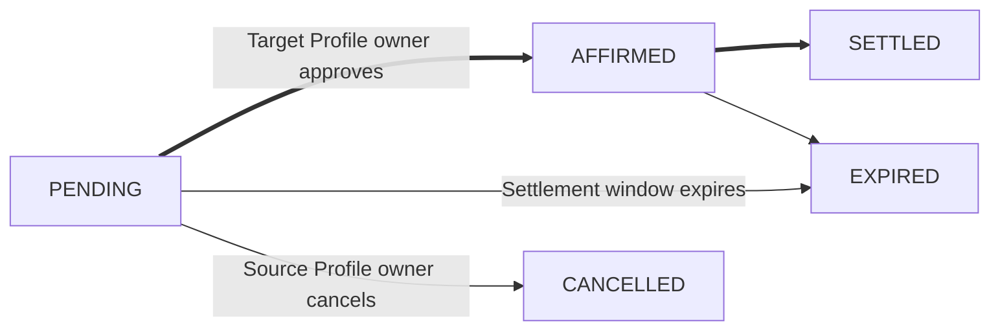

<Description description={frontMatter.description}/>

The [settlement workflow](/guides/settlements#workflow) includes five statuses:

- `PENDING`: Initial state of a settlement transaction upon creation by the Source Profile owner (`source_profile_id`).
- `AFFIRMED`: The settlement transaction has been approved by the Target Profile owner (`target_profile_id`) and will be eligible for settlement once within the transaction window (`settlement_window_start` → `settlement_window_end`).
- `SETTLED`: The assets in the transaction have successfully been transferred.
- `EXPIRED`: The settlement transaction is no longer eligible for settlement.
- `CANCELED`: The settlement transaction was canceled by the Source Profile owner.

When a settlement transactions is [created](/api-reference/endpoints/settlement/create-transaction), it starts in `PENDING` status.
The assets do not need to be available in the Profiles at this stage.
In the `PENDING` state, two actions can be taken:
- The Source Profile owner [cancels](/api-reference/endpoints/settlement/cancel-transaction) the transaction. Status transitions to `CANCELLED`.
- The Target Profile owner [approves](/api-reference/endpoints/settlement/affirm-transaction) the transaction. Status transitions to `AFFIRMED`.

Once the required asset balances are in the respective Profiles, settlement occurs. Status transactions to `SETTLED` when complete.



Transactions in the `PENDING` or `AFFIRMED` state at the end of the settlement window (`settlement_window_end`) automatically transition to `EXPIRED`.

## Find Transactions by Status

Either involved party can use [List Transactions](/api-reference/endpoints/settlement/list-transactions) to retrieve all the transactions they are counterparty to.
Use the `statuses` query parameter to filter based on status.

<Tip>

You must specify the `limit` of items per page or an error returns.

</Tip>

```shell
curl --location 'https://api.sandbox.paxos.com/v2/settlement/transactions?statuses=PENDING&statuses=AFFIRMED&limit=2' \
--header 'Authorization: Bearer {access_token}'
```

Based on the request parameters, the response contains the two most recent open transactions.

```json highlight={30,61,66}
{
    "items": [
        {
            "id": "{unique_transaction_id}",
            "ref_id": "required_idempotence_id_1",
            "settlement_window_start": "YYYY-MM-DDT00:00:00Z",
            "settlement_window_end": "YYYY-MM-DDT00:00:00Z",
            "source_profile_id": "{profile_id}",
            "target_profile_id": "{profile_id}",
            "legs": [
                {
                    "id": "{unique_leg_1_id}",
                    "direction": "DELIVER",
                    "asset": "BTC",
                    "amount": "1"
                },
                {
                    "id": "{unique_leg_2_id}",
                    "direction": "DELIVER",
                    "asset": "ETH",
                    "amount": "5"
                },
                {
                    "id": "{unique_leg_3_id}",
                    "direction": "RECEIVE",
                    "asset": "USD",
                    "amount": "40000"
                }
            ],
            "status": "PENDING",
            "created_at": "YYYY-MM-DDT00:00:00Z",
            "updated_at": "YYYY-MM-DDT00:00:00Z"
        },
        {
            "id": "{unique_transaction_id}",
            "ref_id": "required_idempotence_id",
            "settlement_window_start": "YYYY-MM-DDT00:00:00Z",
            "settlement_window_end": "YYYY-MM-DDT00:00:00Z",
            "source_profile_id": "{profile_id}",
            "target_profile_id": "{profile_id}",
            "legs": [
                {
                    "id": "{unique_leg_1_id}",
                    "direction": "DELIVER",
                    "asset": "BTC",
                    "amount": "1"
                },
                {
                    "id": "{unique_leg_2_id}",
                    "direction": "DELIVER",
                    "asset": "ETH",
                    "amount": "5"
                },
                {
                    "id": "{unique_leg_3_id}",
                    "direction": "RECEIVE",
                    "asset": "USD",
                    "amount": "40000"
                }
            ],
            "status": "AFFIRMED",
            "created_at": "YYYY-MM-DDT00:00:00Z",
            "updated_at": "YYYY-MM-DDT00:00:00Z"
        }
    ],
    "next_page_cursor": "{page_cursor_value}"
}
```

To view more items, add the `page_cursor` query parameter to the request.

```shell highlight={1}
curl --location 'https://api.sandbox.paxos.com/v2/settlement/transactions?limit=2&page_cursor={page_cursor_value}' \
--header 'Authorization: Bearer {access_token}'
```
