<Warning>
**Key Risks**
- **Bridging Risks**: Bridged tokens carry cross-chain security risks not present in native tokens
- **Third-Party Issuer**: Paxos is not the issuer of bridged tokens until native upgrade occurs
- **Upgrade Not Guaranteed**: Native issuance upgrade is at Paxos's discretion and not guaranteed
- **Smart Contract Risk**: Bridge contracts may contain vulnerabilities
</Warning>

## Overview
This standard enables teams to deploy bridged forms of Paxos stablecoins on EVM blockchains using LayerZero's Omnichain Fungible Token (OFT) standard, with a potential upgrade path to native Paxos issuance.

### Key Terms
| Term | Definition                                                                                                                                                               |
|------|--------------------------------------------------------------------------------------------------------------------------------------------------------------------------|
| **Native Token** | Paxos-issued stablecoin on the original chain                                                                                                                             |
| **Bridged Token** | Team-deployed token representing locked native tokens                                                                                                                    |
| **OFTWrapper** | Contract that burns tokens when bridging out and mints tokens when bridging in                                                                                              |
| **Lock/Unlock Adapter** | Contract that locks tokens when bridging out and unlocks tokens when bridging in                                                                                   |

## High Level Steps

1. **Deploy Token Contract**: Team deploys the bridged Paxos stablecoin following exact specifications ([Token Deployment](#token-deployment))
2. **Deploy OFTWrapper**: Team deploys LayerZero `OFTWrapper` to interface with the bridged token ([OFT Wrapper Implementation](#oft-wrapper-implementation))
3. **Setup Lock/Unlock Adapter**: Team deploys adapter on the native chain to lock/unlock native tokens ([Lock/Unlock Adapter](#lock-unlock-adapter))
4. **Configure LayerZero**: Connect endpoints for cross-chain message passing and verification
5. **Optional Native Upgrade**: Follow the [Native Token Upgrade Process](#native-token-upgrade-process) if Paxos agrees to native issuance
6. **Maintain Operations**: Native token retains existing supply, holders, and bridging capabilities

## Lock/Unlock Adapter

The lock/unlock adapter operates on the native token chain (Chain A) and manages the collateral backing for bridged tokens.

### How It Works

**Bridging Out (Chain A to Chain B)**:

```mermaid
%%{init: { 'themeVariables': { 'edgeLabelBackground': '#43494E', 'textColor': '#fff' } } }%%
flowchart LR
    subgraph ChainA[Chain A - Native]
        direction LR
        A1[User] -->|Lock Native Tokens| A2[Lock/Unlock Adapter]

    end

    subgraph ChainB[Chain B - Bridged]
        direction LR
        B1[OFTWrapper] -->|Mint Bridged Tokens| B2[User]
    end

    A2 -.->|LayerZero<br/>Protocol| B1
    
    style A1 fill:#19282F
    style A2 fill:#19282F
    style B1 fill:#00845E
    style B2 fill:#19282F
```

**Bridging Back (Chain B to Chain A)**:

```mermaid
%%{init: { 'themeVariables': { 'edgeLabelBackground': '#43494E', 'textColor': '#fff' } } }%%
flowchart LR
    subgraph ChainB[Chain B - Bridged]
        direction LR
        B1[User] -->|Burn Bridged Tokens| B2[OFTWrapper]
    end
    
    subgraph ChainA[Chain A - Native]
        direction LR
        A1[Lock/Unlock Adapter] -->|Unlock Native Tokens| A2[User]
    end
    
    B2 -.->|LayerZero<br/>Protocol| A1
    
    style A1 fill:#19282F
    style A2 fill:#19282F
    style B1 fill:#19282F
    style B2 fill:#00845E
```

1. **Bridging Out (Chain A → B)**:
   - User sends native tokens to the adapter
   - Adapter locks tokens in its contract
   - Adapter sends LayerZero message to OFTWrapper on Chain B
   - OFTWrapper mints equivalent bridged tokens to user on Chain B

2. **Bridging Back (Chain B → A)**:
   - User sends bridged tokens to OFTWrapper on Chain B
   - OFTWrapper burns the bridged tokens
   - OFTWrapper sends LayerZero message to adapter on Chain A
   - Adapter unlocks and transfers native tokens to user

> The lock/unlock adapter is deployed and managed by the team operating the bridge.

## Token Deployment

### Token Contract Requirements
Paxos stablecoins are maintained in the [paxos-token-contracts](https://github.com/paxosglobal/paxos-token-contracts)
repository. The repository contains Hardhat scripts to help with deployment. `PaxosTokenV2` leverages a separately deployed
`SupplyControl` contract to control the token supply. Deploying both contracts is required to properly manage minting and burning.

Deployed token requirements for native issuance eligibility:
1. **Implement Paxos Token Standards**: Use the official Paxos token and `SupplyControl` implementations. Deployed bytecode must match exactly (excluding metadata changes).
2. **Support Minter Pattern**: Allow the `OFTWrapper` to mint and burn tokens via `SupplyControl`.
3. **Upgradeable Contracts**: Both `PaxosTokenV2` and `SupplyControl` must be upgradeable.
4. **No Unauthorized Upgrades**: The contract should only ever be upgraded with Paxos's explicit consent.
<Warning>**Warning:** Unauthorized upgrades will disqualify token from native migration</Warning>

Deployed token recommendations:
1. **Use UUPSUpgradeable Proxy**: This proxy pattern is safer for upgrading and should be used for all new token deployments. See the [USDG contract](https://github.com/paxosglobal/paxos-token-contracts/blob/master/contracts/stablecoins/USDG.sol#L12) for usage.

### Metadata Guidelines

To avoid confusion between native and bridged stablecoins, metadata must clearly indicate bridged status:

| Field | Rule | Example |
|-------|------|---------|  
| **Token Name** | `Bridged <Token Name> (Team Name)` | `Bridged PYUSD (Crete)` |
| **Symbol** | Original + prefix/suffix | `cPYUSD` or `PYUSD.c` |
| **Decimals** | Same as native token | `6` |

### Role Management
All roles must be implemented with proper separation:

**Token Contract Roles**:
1. **Admin**: Controls administrative functions and role assignments
2. **Asset Protection**: Manages address restrictions per Paxos requirements  
3. **Pauser**: Can pause token transfers in emergencies and during migration

**SupplyControl Contract Roles**:
1. **Admin**: Controls administrative functions and role assignments
2. **Supply Controller**: Manages minting and burning (initially the OFT wrapper)
3. **Supply Controller Manager**: Can add, update, and remove SupplyControllers

## OFTWrapper Implementation

The `OFTWrapper` serves as the connection between LayerZero's cross-chain messaging protocol and Paxos token contracts. This wrapper must implement specific functionality to support both normal operations and the eventual upgrade process. It's highly recommended to use the Paxos `OFTWrapper`
implementation found in [cross-chain-contracts](https://github.com/paxosglobal/cross-chain-contracts). The repo contains
scripts to help with deployment as well as setting up the LayerZero bridge.

Once the OFTWrapper is deployed and the bridge is wired, make sure to also grant it mint permissions in `SupplyControl` by calling `addSupplyController`.

If the team wants to use a different OFT wrapper, check with Paxos as this may make the token ineligible for the native token migration.

### Fallback Scenarios

If Paxos declines to upgrade to native issuance:
- The bridged token continues operating under team management indefinitely
- Bridge operations remain functional with the lock/unlock mechanism
- Team retains responsibility for security, compliance, and operations
- Users should be aware that the token remains a bridged asset with associated risks

## Native Token Upgrade Process
Paxos will take ownership of the bridged token and bridge upon mutual agreement. When this happens:

1. **Pause Operations**: Bridged token on Chain B is paused, current supply recorded
2. **Disable Bridge**: Remove current lock/unlock peer configuration
3. **Transfer Ownership**: Transfer roles to Paxos for all contracts (token, `SupplyControl`, `OFTWrapper`)
4. **Update Metadata**: Remove "Bridged" designation from name and symbol
5. **Balance Supply**: Paxos burns locked tokens on Chain A matching Chain B supply
6. **Reconfigure Bridge**: Update OFT peers to connect Chain B directly to Chain A mint/burn `OFTWrapper`
7. **Resume Operations**: Token becomes natively issued and is unpaused

### Post-Upgrade Architecture

```mermaid
%%{init: { 'themeVariables': { 'edgeLabelBackground': '#43494E', 'textColor': '#fff' } } }%%
flowchart LR
    subgraph ChainA[Chain A - Native]
        direction LR
        A1[User] -->|Burn Native Tokens| A2[OFTWrapper]
    end
    
    subgraph ChainB[Chain B - Native]
        direction LR
        B1[OFTWrapper] -->|Mint Native Tokens| B2[User]
    end
    
    A2 <-.->|LayerZero<br/>Protocol| B1
    
    style A1 fill:#19282F
    style A2 fill:#00845E
    style B1 fill:#00845E
    style B2 fill:#19282F
```

After the upgrade:
- Both chains have native Paxos-issued tokens
- Direct mint/burn bridging between chains (no lock/unlock)
- Paxos controls all contracts and operations
- Unified supply management across chains

## Security Considerations

### Multi-Chain Security

1. **Endpoint Security**: LayerZero endpoints must be properly configured and monitored
2. **Rate Limiting**: Implement appropriate rate limits to prevent large-scale exploits
3. **Cross-Chain Verification**: Rely on LayerZero's message verification system
4. **Emergency Pause**: Maintain ability to pause bridging across all integrated chains

### Upgrade Security

1. **Token Pausing**: The token will be paused during the upgrade
2. **Supply Verification**: The bridged supply will be thoroughly audited before upgrade
3. **Role Transfer**: Roles will be validated to ensure all team access is revoked
4. **Burn Verification**: The burn amount will be confirmed to exactly match the bridged supply

## Implementation Checklist

Before deploying bridged Paxos stablecoins:

### Contract Deployment
- [ ] Deploy token and `SupplyControl` contracts with correct parameters
- [ ] Deploy `OFTWrapper` with correct LayerZero endpoint configuration  
- [ ] Deploy lock/unlock adapter on native chain
- [ ] Grant `OFTWrapper` mint permissions via `SupplyControl`
- [ ] Configure rate limits (10% daily volume/hour recommended)

### Testing Requirements
- [ ] Test cross-chain transfers on testnet (both directions)
- [ ] Verify supply consistency across chains
- [ ] Test emergency pause functionality
- [ ] Validate rate limiting behavior
- [ ] Confirm metadata displays correctly

### Operational Setup  
- [ ] Implement monitoring for bridge operations
- [ ] Set up alerts for anomalies
- [ ] Document emergency procedures with contact info
- [ ] Establish communication channels with Paxos team
- [ ] Create runbooks for common scenarios

## Technical Requirements

### Mainnet Deployment

1. **Bytecode Verification**: Must exactly match audited Paxos contracts
2. **Testnet Parity**: Must exactly match testnet deployments
3. **Explorer Verification**: All contracts verified on block explorers
4. **Metadata Preservation**: Compiler metadata must be available
5. **Governance Documentation**: Documents all signers and their roles

## Monitoring

Teams should monitor:
- Bridge transaction volumes and patterns
- Rate limit utilization
- Failed or stuck transactions
- LayerZero endpoint health
- Token supply consistency across chains

## Notice
The Bridged Stablecoin Standard grants Paxos the option, but not the obligation, to obtain ownership of the token contract and upgrade to native issuance.
The Bridged Stablecoin Standard must be incorporated prior to deployment and cannot be retroactively applied.
The Bridged Stablecoin Standard is for informational purposes and will only apply should Paxos choose to upgrade a particular bridged stablecoin to native issuance.
The Bridged Stablecoin Standard does not constitute an offer to upgrade a particular form of bridged stablecoin.
Paxos's decision to upgrade a particular bridged stablecoin to native issuance may be subject to additional terms and conditions.
Bridged tokens are not issued by Paxos and carry additional risks related to bridge security and cross-chain operations.

## References

### External Documentation
- [LayerZero OFT Documentation](https://docs.layerzero.network/v2/developers/evm/oft/quickstart)
- [LayerZero Deployed Contracts](https://docs.layerzero.network/v2/developers/evm/technical-reference/deployed-contracts)
- [Paxos Token Contracts Repository](https://github.com/paxosglobal/paxos-token-contracts)
- [Paxos Cross-Chain Contracts Repository](https://github.com/paxosglobal/cross-chain-contracts)

> Questions? Contact [Support](https://support.paxos.com).