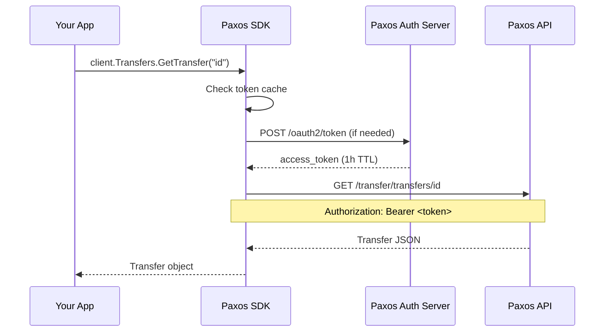

Paxos uses OAuth2 client credentials (machine-to-machine) for authentication. The SDK manages the full token lifecycle automatically — you provide your credentials once when creating the client, and every API call is authenticated transparently.

## How It Works

When you make an API call, the SDK:

1. Checks for a cached access token
2. If no valid token exists, requests one from the Paxos auth server
3. Injects the `Authorization: Bearer <token>` header into your request
4. Caches the token until it expires (with a 60-second safety buffer)
5. Refreshes the token automatically before expiry



You never need to call the token endpoint directly or manage token expiry.

## Client Setup

<CodeGroup>

```go Go
client, err := paxos.NewClient(
    os.Getenv("PAXOS_CLIENT_ID"),
    os.Getenv("PAXOS_CLIENT_SECRET"),
    paxos.WithSandbox(),
)
if err != nil {
    log.Fatal(err)
}

// All calls are automatically authenticated
transfer, err := client.Transfers.GetTransfer(ctx, "txn_123")
```

```python Python
client = paxos.Client(
    client_id=os.environ["PAXOS_CLIENT_ID"],
    client_secret=os.environ["PAXOS_CLIENT_SECRET"],
    sandbox=True,
)

# All calls are automatically authenticated
transfer = client.transfers.get_transfer("txn_123")
```

```typescript TypeScript
const client = new PaxosClient({
  clientId: process.env.PAXOS_CLIENT_ID!,
  clientSecret: process.env.PAXOS_CLIENT_SECRET!,
  sandbox: true,
});

// All calls are automatically authenticated
const transfer = await client.transfers.getTransfer("txn_123");
```

```java Java
PaxosClient client = PaxosClient.builder()
    .clientId(System.getenv("PAXOS_CLIENT_ID"))
    .clientSecret(System.getenv("PAXOS_CLIENT_SECRET"))
    .sandbox(true)
    .build();

// All calls are automatically authenticated
Transfer transfer = client.transfers().getTransfer("txn_123");
```

</CodeGroup>

## Token Lifecycle

- Tokens are cached for their full TTL (typically 1 hour) minus a 60-second buffer
- Automatic refresh happens before expiry — no interrupted requests
- Thread-safe: concurrent requests share a single token, and only one refresh runs at a time
- On `401` responses, the SDK invalidates the cache, fetches a new token, and retries once

## Credential Management

<Warning>
Never hardcode credentials in source code. Always use environment variables or a secret manager.
</Warning>

**Environment variables** (recommended for local development):

```bash
export PAXOS_CLIENT_ID="your_client_id"
export PAXOS_CLIENT_SECRET="your_client_secret"
```

**Secret managers** (recommended for production):

Use your infrastructure's secret manager (AWS Secrets Manager, GCP Secret Manager, HashiCorp Vault) to inject credentials at runtime. The SDK accepts credentials as strings, so any secret source works.

## Multiple Environments

Use separate clients for Sandbox and Production. Each environment has its own credentials and base URL.

<CodeGroup>

```go Go
sandboxClient, _ := paxos.NewClient(
    os.Getenv("PAXOS_SANDBOX_CLIENT_ID"),
    os.Getenv("PAXOS_SANDBOX_CLIENT_SECRET"),
    paxos.WithSandbox(),
)

prodClient, _ := paxos.NewClient(
    os.Getenv("PAXOS_PROD_CLIENT_ID"),
    os.Getenv("PAXOS_PROD_CLIENT_SECRET"),
    // Production is the default
)
```

```python Python
sandbox_client = paxos.Client(
    client_id=os.environ["PAXOS_SANDBOX_CLIENT_ID"],
    client_secret=os.environ["PAXOS_SANDBOX_CLIENT_SECRET"],
    sandbox=True,
)

prod_client = paxos.Client(
    client_id=os.environ["PAXOS_PROD_CLIENT_ID"],
    client_secret=os.environ["PAXOS_PROD_CLIENT_SECRET"],
)
```

```typescript TypeScript
const sandboxClient = new PaxosClient({
  clientId: process.env.PAXOS_SANDBOX_CLIENT_ID!,
  clientSecret: process.env.PAXOS_SANDBOX_CLIENT_SECRET!,
  sandbox: true,
});

const prodClient = new PaxosClient({
  clientId: process.env.PAXOS_PROD_CLIENT_ID!,
  clientSecret: process.env.PAXOS_PROD_CLIENT_SECRET!,
});
```

```java Java
PaxosClient sandboxClient = PaxosClient.builder()
    .clientId(System.getenv("PAXOS_SANDBOX_CLIENT_ID"))
    .clientSecret(System.getenv("PAXOS_SANDBOX_CLIENT_SECRET"))
    .sandbox(true)
    .build();

PaxosClient prodClient = PaxosClient.builder()
    .clientId(System.getenv("PAXOS_PROD_CLIENT_ID"))
    .clientSecret(System.getenv("PAXOS_PROD_CLIENT_SECRET"))
    .build();
```

</CodeGroup>

## Getting API Credentials

➊ Sign in to the [Paxos Dashboard](https://dashboard.paxos.com/) (or [Sandbox Dashboard](https://dashboard.sandbox.paxos.com/))

➋ Navigate to **Developer** > **API Credentials**

➌ Create a new credential pair and select the required [scopes](/guides/developer/credentials)

➍ Save the **Client ID** and **Client Secret** — the secret is only shown once

> Scopes for each endpoint are listed in the **Authorizations** section of the [API Reference](/api-reference).
